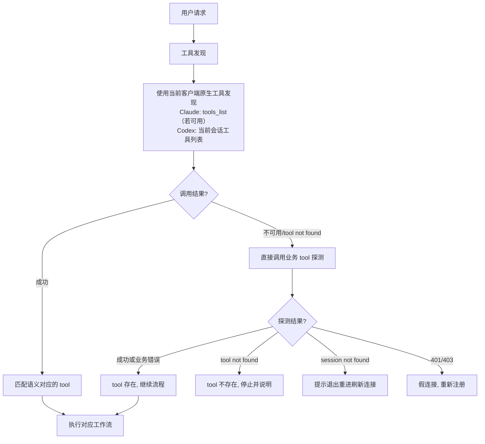
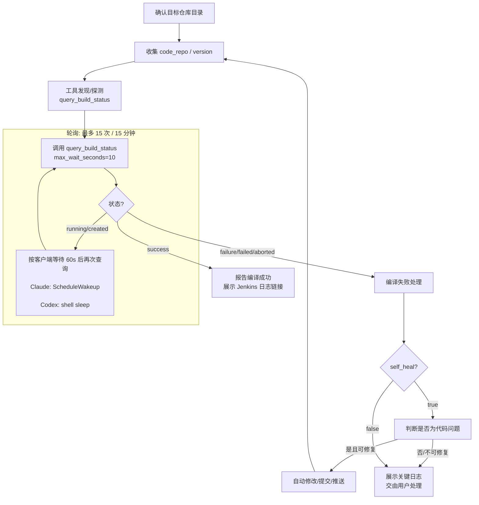
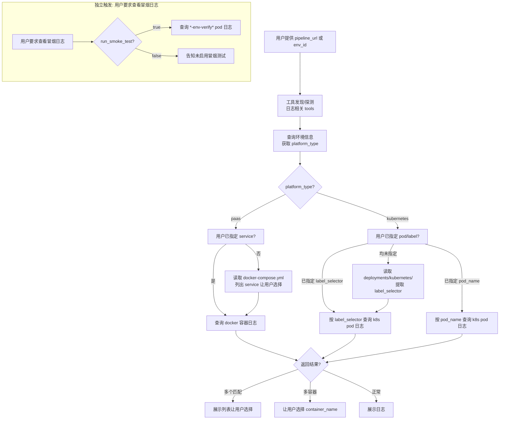
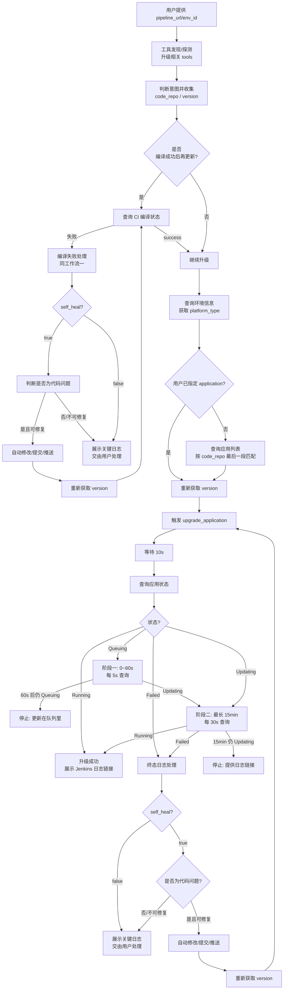
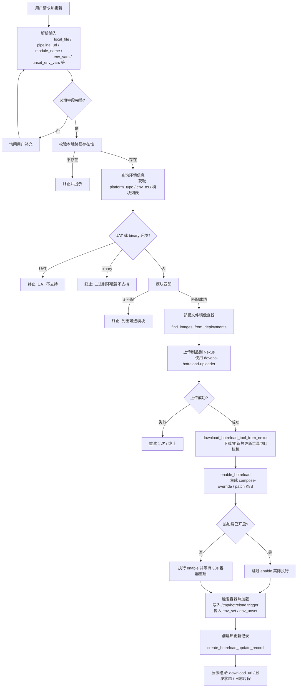

# DevOps MCP Invoker

> **必读说明（Read First）**
>
> 本 skill 是**流程控制型 skill**。`SKILL.md` 只保留核心流程、决策要点和速查表，是**骨架**；
> `REFERENCES-*.md` 系列文件（`CONNECTION`、`DISCOVERY`、`BUILD`、`DEPLOY`、`HOTRELOAD`、`TROUBLESHOOTING`）存放 MCP 连接/注册、工具发现、失败处理、提交信息规范、终态日志处理、热更新执行细节等**执行级细节和强制约束**。
>
> **执行任何工作流前，必须按本文件提示先阅读对应 `REFERENCES-*.md` 文件的相关章节；禁止只读 `SKILL.md` 就调用 MCP tools。**
> 具体 tool 的 schema、参数和返回值以当前 MCP server 为准。

本 skill 将用户的自然语言请求转换为对远程 MCP server `pipeline-integration-mcp` 的有序调用。只负责：识别意图、收集本地上下文、决定调用顺序与轮询策略、显式传参、按规范输出。

---

## 客户端适配（Claude Code / Codex）

本 skill 同时支持 Claude Code 和 Codex。业务流程保持一致，仅注册方式、会话刷新、tool 命名和轮询调度按客户端适配。

| 能力 | Claude Code | Codex |
|------|-------------|-------|
| MCP 注册 | 用户说“调用 devops-mcp-invoker 注册 MCP，token 是 <token>”，由 skill 代为注册 | 同上；由 skill 在 Codex 中代为注册，不要要求用户执行 `codex` 命令或手工编辑配置。若检测到不支持 `--header`，提示用户升级 Codex 到最新版 |
| 连接检查 | `claude mcp list` 中为 `connected` | `codex mcp list` 中为 `enabled` |
| 配置生效 | 首次注册后执行 `/clear` 或退出重进 | 重启 Codex 或新建会话 |
| tool 命名 | 通常为 `mcp__pipeline-integration-mcp__<tool>` | 使用 Codex 注入的 MCP 命名空间，server 名中的 `-` 可能显示为 `_`；不要硬编码前缀 |
| 工具发现 | 若暴露 `tools_list` 则调用，否则直接探测业务 tool | 直接使用当前会话已注入的 MCP tools，不要假设存在 `tools_list` |
| 轮询调度 | `ScheduleWakeup` | shell 等待后继续查询（Windows PowerShell `Start-Sleep -Seconds N`；Bash `sleep N`） |
| Shell | 按脚本声明的 shell | Windows 默认 PowerShell；Linux/macOS 用 Bash；命令按当前环境等价替换 |

> 具体注册流程和刷新要求见 [REFERENCES-CONNECTION.md §1](./references/REFERENCES-CONNECTION.md#1-mcp-连接与注册细节)。

---

## 目录

- [客户端适配（Claude Code / Codex）](#客户端适配claude-code--codex)
- [前置条件](#前置条件)
- [工具发现](#工具发现)
- [核心工作流总览](#核心工作流总览)
- [通用控制规则](#通用控制规则)
- [工作流一：查询 CI 编译状态](#工作流一查询-ci-编译状态)
- [工作流二：查看容器Pod 日志](#工作流二查看容器pod-日志)
- [工作流三：升级环境应用](#工作流三升级环境应用)
- [工作流四：模块热更新（Hot Reload）](#工作流四模块热更新hot-reload)
- [输出规范](#输出规范)
- [常见错误处理](#常见错误处理)
- [注意事项](#注意事项)

---

## 前置条件

> **执行前必读**：[REFERENCES-CONNECTION.md §1 MCP 连接与注册细节](./references/REFERENCES-CONNECTION.md#1-mcp-连接与注册细节) 和 [§2 工具发现](./references/REFERENCES-DISCOVERY.md#2-工具发现)。不满足以下条件前，禁止调用业务 tool。

1. MCP server `pipeline-integration-mcp` 已注册且连接正常：由 skill 使用 `claude mcp list` 或 `codex mcp list` 检查；未注册时，由 skill 按注册流程代为注册，不要要求用户自行执行注册命令。
2. Token 有效：非空、非占位符、长度 ≥ 8。
3. **首次注册或修改 MCP 配置后必须刷新会话**：Claude Code 执行 `/clear` 或退出重进；Codex 重启或新建会话。刷新前禁止直接模拟 MCP 协议探测 tools。
4. 调用业务 tool 前先[工具发现](#工具发现)，确认能力可用。

> 注册流程、默认地址、Token 规则、客户端刷新要求和假连接识别等详细流程见 [REFERENCES-CONNECTION.md §1](./references/REFERENCES-CONNECTION.md#1-mcp-连接与注册细节)。

---

## 工具发现

> **执行前必读**：[REFERENCES-DISCOVERY.md §2 工具发现](./references/REFERENCES-DISCOVERY.md#2-工具发现)。

在根据用户意图执行具体业务操作之前，必须先确认当前 MCP server 提供对应能力。



### 简要规则

- **Claude Code**：若当前会话暴露 `mcp__pipeline-integration-mcp__tools_list`，优先调用它获取工具列表；若客户端不支持或调用失败，直接尝试调用语义对应的业务 tool 探测。
- **Codex**：直接使用当前会话已注入的 `pipeline-integration-mcp` MCP tools，按其实际名称匹配；不要假设存在 `tools_list`，也不要用脚本直连 MCP endpoint 获取工具列表。
- **tool 命名**：Claude Code 与 Codex 的命名空间可能不同，server 名中的 `-` 在 Codex 中可能显示为 `_`。始终以当前会话实际暴露的 tool 名称为准，不要硬编码前缀。
- 若工具调用返回 `session not found` 或连接错误 → 会话可能已失效，提示用户退出重进刷新 MCP 连接。
- 可用 `claude mcp list`（Claude Code）或 `codex mcp list`（Codex）检查服务器状态，但不要用它获取工具列表。
- 禁止用 `curl`/`wget`/`python`/PowerShell 等直接访问 MCP endpoint 探测 tools。

> 工具发现完整流程与输出原则见 [REFERENCES-DISCOVERY.md §2](./references/REFERENCES-DISCOVERY.md#2-工具发现)。

---

## 核心工作流总览

| 工作流 | 触发条件 | 是否需要 git | 关键决策点 |
|--------|----------|--------------|------------|
| 查询 CI 编译状态 | 用户问某个仓库/版本的编译结果 | 是 | 版本来源：当前 HEAD 或用户指定 |
| 查看容器/Pod 日志 | 用户查某个环境、service 或 pod 的日志 | 否 | 按 `platform_type` 分流到 docker 或 k8s；优先使用用户指定的模块名 |
| 升级环境应用 | 用户要求更新环境、部署版本（非热更新） | 是 | 意图识别：区分普通更新 vs 热更新；用户指定版本 vs. "编译成功后再更新"；失败后是否自我修复 |
| 模块热更新 | 用户指明"热更新""热加载"或将**本地文件/目录**更新到流水线环境 | 否 | 跳过 CI 编译和 `upgrade_application`，走本地上传 -> 容器内热加载 |

---

## 通用控制规则

1. **目标仓库**：默认使用当前工作目录，不是 MCP server 所在仓库。
2. **按需收集 git 信息**：只有查询 CI 编译状态和升级应用时才执行 git 命令；查看日志时禁止执行 git。
3. **参数显式传递**：MCP server 不会自动读取用户目录，所有参数由 skill 收集后显式传入。
4. **模块名解析**：默认取 `code_repo` 最后一段，用户可显式指定。
5. **多匹配时必须让用户选择**：容器/pod/应用返回多个匹配时，展示列表由用户选择。
6. **重试策略**：调用 MCP tool 时，业务状态（`running`/`created`/`Updating`）不是超时；非业务错误最多静默重试 1 次。
7. **单次触发原则**：同一个自我修复循环内，向 MCP 触发应用升级只能调用一次；进入下一轮修复循环后可再次触发。
8. **自我修复开关**：
   - `self_heal = false`：用户说"只更新一次"、"不要自己提交代码"、"只展示日志"等。
   - 否则默认 `self_heal = true`。
9. **自我修复上限**：最多 3 次（含首次失败后的修复），第 3 次失败后必须停止并请求人工介入。
10. **多仓库目录选择**：workspace 下多个 git 仓库时，先让用户指定目标目录。

---

## 工作流一：查询 CI 编译状态

> **执行前必读**：
> - [REFERENCES-BUILD.md §4 编译失败处理细节](./references/REFERENCES-BUILD.md#4-编译失败处理与-ci-轮询)
> - 若触发自修复提交代码，必须同时阅读并遵循下面的**提交信息规范**。

### 输入

- `code_repo`：从 `git remote get-url origin` 解析出的仓库路径。
- `version`：默认取 `git rev-parse --short HEAD` 前 7 位；用户可显式指定。

解析规则示例：
- `https://code.in.wezhuiyi.com/devops/web-backend.git` → `devops/web-backend`
- `ssh://git@code.in.wezhuiyi.com:60022/devops/web-backend.git` → `devops/web-backend`
- `git@code.in.wezhuiyi.com:devops/web-backend.git` → `devops/web-backend`

### 流程图



### 轮询规则（必须严格执行）

`running`/`created` 是**中间状态，不是终态**。除非达到轮询上限，否则**禁止停止并让用户"稍后再次查询"**。

1. 调用 `query_build_status` 后，若状态为 `running`/`created`：
   - 向用户展示当前状态、Jenkins 日志链接、已轮询次数/已等待时间。
   - **立即安排下一次查询**，不要等待用户回复：
     - **Claude Code**：调用 `ScheduleWakeup`，`delaySeconds=60`，prompt 必须包含目标仓库、版本、已轮询次数和已等待时间。
     - **Codex**：使用当前 shell 等待 60 秒后继续查询（Windows PowerShell：`Start-Sleep -Seconds 60`；Bash：`sleep 60`）。命令未结束时继续等待该会话返回，不要改问用户。
     - 若当前客户端提供原生后台任务/定时器，优先使用客户端能力。
   - 安排下一次查询时，提示信息必须包含：
     - 目标仓库 `<code_repo>` 和版本 `<version>`
     - 当前已轮询次数 N 和已等待时间（用于累计上限判断）
     - 例如："继续查询 `<code_repo>` `<version>` 的 CI 编译状态，当前已轮询 1 次/已等待 60 秒，最长 15 分钟/15 次"
2. 每次轮询继续后重新调用 `query_build_status`（`max_wait_seconds=10`），并累计轮询次数。
3. 轮询上限（满足任一条件即停止）：
   - 累计达到 **15 次**，或
   - 累计达到 **15 分钟**。
   - 达到上限后仍为 `running`/`created` → 停止轮询，告知用户编译仍在运行但已超时，提供 Jenkins 日志链接。
4. `running`/`created` 期间**不获取 Jenkins 日志详细内容**。
5. `success` 或失败状态 → 进入对应终态处理，不再轮询。

> 轮询的详细行为、超时处理、输出原则见 [REFERENCES-BUILD.md §4.5 轮询规则](./references/REFERENCES-BUILD.md#45-轮询规则)。

### 编译失败处理

1. **获取 Jenkins 日志**：从 MCP 结果中提取 Jenkins 日志链接，将 `/console` 替换为 `/consoleText` 获取纯文本；context-mode 可用时优先用其抓取并过滤关键错误片段；否则按当前客户端使用 PowerShell/Bash/Python/Node fallback。详见 [REFERENCES-BUILD.md §4.2](./references/REFERENCES-BUILD.md#42-获取-jenkins-日志)。
2. **判断失败原因**：是否为最近修改的代码导致且可自动修复。
3. **自我修复**（`self_heal = true`）：
   - 能定位且可修复 → 直接修改、提交、推送，重新查询编译状态。
   - 无法定位或不确定 → 停止，展示失败原因和日志链接，交由用户处理。
4. **提交信息规范**（必须满足项目 hook 校验）：
   - 标题行以 `[类型]` 开头，类型在项目白名单中（修复场景常用 `[fix]` / `[bugfix]`）。
   - 标题长度（含类型标记）≥ 11 个字符。
   - 必须包含关联单号：`--story=<id>` / `--task=<id>` / `--bug=<id>` 或 `--jira=<KEY-NUM>`。
   - 必须包含用户标记：`--user=<git config user.name>`。
   - 提交者邮箱需符合项目邮箱域名要求。
   - `Revert` 提交跳过规范检查。
   - 第二行为空行；第三行沿用最近一次用户提交的单号信息并追加 `--user=<git config user.name>`。
   - 示例：
     ```
     [fix] 修复 app.json 中 readinessProbe 末尾多余逗号导致的 JSON 解析错误

     --story=1022383 --user=walkernie 【CI流程一期】代码提交规范检查 https://www.tapd.cn/51449271/s/1436535
     - 删除 app.json:22 的尾随逗号
     - 本地 JSON 校验通过
     ```

> 日志获取、可修复/不可修复判定、提交信息规范等细节见 [REFERENCES-BUILD.md §4](./references/REFERENCES-BUILD.md#4-编译失败处理与-ci-轮询)。

---

## 工作流二：查看容器/Pod 日志

> **执行前必读**：若涉及冒烟日志或环境类型判断，参考 [REFERENCES-DEPLOY.md §5 升级应用终态日志处理细节](./references/REFERENCES-DEPLOY.md#5-升级应用终态日志处理细节)。

### 输入

- `project_id`/`env_id`：优先从 `pipeline_url` 解析，否则询问用户。
- 模块名（可选）：用户可能直接说出 service 名或 pod 名。

### 流程图



### 分流规则

| 环境类型 | 用户已指定 | 处理方式 |
|----------|------------|----------|
| paas | service 名 | 直接查询 docker 容器日志 |
| paas | 未指定 | 读取 `docker-compose.yml` 列出 service，让用户选择 |
| kubernetes | label_selector | 直接作为 `label_selector` 查询，不传 `pod_name` |
| kubernetes | pod_name | 直接作为 `pod_name` 查询，不传 `label_selector` |
| kubernetes | 均未指定 | 从 `deployments/kubernetes/` 下 yaml 提取 `app.kubernetes.io/name` 作为 `label_selector` |

### 冒烟日志

- 仅 kubernetes。
- 用户明确要求时，先确认 `run_smoke_test=true`。
- 查询 pod 名包含 `env-verify` 的日志，不传入 `label_selector`。

---

## 工作流三：升级环境应用

> **执行前必读**：
> - [REFERENCES-DEPLOY.md §5 升级应用终态日志处理细节](./references/REFERENCES-DEPLOY.md#5-升级应用终态日志处理细节)
> - 若触发自修复提交代码，必须同时阅读并遵循下面的**提交信息规范**。

### 意图识别

> **关键区分**：在进入工作流三之前，必须先判断用户意图属于**普通更新**还是**模块热更新（工作流四）**。以下场景属于工作流四，**禁止走本工作流**：
> - 用户明确提到"热更新""热加载""hot reload""hotreload"。
> - 用户指定将**本机/本地某个文件或目录**更新到流水线环境（即制品来源于本地而非 CI 编译）。
>
> 若判定为热更新，直接跳转到[工作流四](#工作流四模块热更新hot-reload)，不要调用 `upgrade_application`。

| 用户表述 | 版本来源 | 是否检查编译状态 |
|----------|----------|------------------|
| "更新到 v1.2.3" / "更新到 commit abc123" | 使用用户指定版本 | 否 |
| "编译成功后更新环境" 等 | 取触发升级前当前最新的 `git rev-parse --short HEAD` | 是 |

### 流程图



### 轮询规则（必须严格执行）

`Queuing`/`Updating` 是**中间状态，不是终态**。除非达到阶段上限，否则**禁止停止并让用户"稍后再次查询"**。

| 阶段 | 时间范围 | 查询间隔 | 状态处理 |
|------|----------|----------|----------|
| 阶段一 | 0 ~ 60 秒 | 5 秒 | `Running`/`Failed` → 进入终态日志处理；`Updating` → 阶段二；60 秒后仍 `Queuing` → 停止 |
| 阶段二 | `Updating` 状态，最长 15 分钟 | 30 秒 | `Running`/`Failed` → 进入终态日志处理；15 分钟后仍 `Updating` → 停止并提供日志链接 |

- 必须按客户端能力实现 5s/30s 间隔，持续轮询到终态或达到上限：Claude Code 优先使用 `ScheduleWakeup` 或后台任务；Codex 使用 shell 等待（Windows PowerShell `Start-Sleep -Seconds 5/30`，Bash `sleep 5/30`）后继续查询。
- 轮询期间向用户展示当前阶段、已等待时间、最近一次状态，但**不要提供"稍后查询"选项**。

### 版本获取规则

- **触发升级前必须重新获取 version**：在调用 `upgrade_application` 之前，必须重新执行 `git rev-parse --short HEAD`（或使用用户指定的版本），确保 upgrade 请求使用的是当前工作目录最新 HEAD。禁止复用之前查询编译状态时缓存的 version，避免两次操作之间产生新 commit 导致版本滞后。
- 用户指定版本时，直接使用用户提供的版本，不再重新读取 git HEAD。
- 自我修复后重新触发升级前，同样必须重新获取最新 version。

### 终态日志处理（Failed 状态）

1. **获取 Jenkins 更新日志**：将链接 `/console` 替换为 `/consoleText`；context-mode 可用时优先用其抓取并过滤关键错误片段；否则按当前客户端使用 PowerShell/Bash/Python/Node fallback。详见 [REFERENCES-BUILD.md §4.2](./references/REFERENCES-BUILD.md#42-获取-jenkins-日志)。
2. **判断失败阶段**：部署/更新阶段失败，或冒烟阶段失败。
3. **按需获取日志**：
   - 部署阶段失败 → 模块日志。
   - 冒烟阶段失败 → 模块日志 + 冒烟日志。
4. **判断是否为当前仓库代码问题**。
5. **自我修复**（`self_heal = true`）：
   - 是代码问题且可修复 → 自动修改、提交、推送，重新触发升级。
   - 否或不可修复 → 停止，展示关键日志，交由用户处理。

### 提交信息规范（升级触发自修复时同样必须遵守）

- 标题行以 `[类型]` 开头，类型在项目白名单中（修复场景常用 `[fix]` / `[bugfix]`）。
- 标题长度（含类型标记）≥ 11 个字符。
- 必须包含关联单号：`--story=<id>` / `--task=<id>` / `--bug=<id>` 或 `--jira=<KEY-NUM>`。
- 必须包含用户标记：`--user=<git config user.name>`。
- 提交者邮箱需符合项目邮箱域名要求。
- `Revert` 提交跳过规范检查。
- 第二行为空行；第三行沿用最近一次用户提交的单号信息并追加 `--user=<git config user.name>`。
- 示例：
  ```
  [fix] 修复 app.json 中 readinessProbe 末尾多余逗号导致的 JSON 解析错误

  --story=1022383 --user=walkernie 【CI流程一期】代码提交规范检查 https://www.tapd.cn/51449271/s/1436535
  - 删除 app.json:22 的尾随逗号
  - 本地 JSON 校验通过
  ```

> 日志获取、失败阶段判断、代码问题判定、自我修复细节见 [REFERENCES-DEPLOY.md §5](./references/REFERENCES-DEPLOY.md#5-升级应用终态日志处理细节)。

---

## 工作流四：模块热更新（Hot Reload）

> **执行前必读**：[REFERENCES-HOTRELOAD.md](./references/REFERENCES-HOTRELOAD.md) — 本文件存放热更新的所有执行级细节与强制约束，调用前必须完整阅读。
> 本小节只保留骨架流程和关键决策点。

### 触发条件（与工作流三的区分）

以下场景属于热更新，**禁止走工作流三（`upgrade_application`）**：

- 用户明确提到「热更新」「热加载」「hot reload」「hotreload」。
- 用户指定将**本机/本地某个文件或目录**更新到流水线环境（制品来源于本地，不经过 CI 编译）。
- 语义包含「将本地 `<文件>` 更新到流水线」「直接替换容器内制品」等。

### 核心流程



**强制顺序**：上传成功后，**必须先调用 `download_hotreload_tool_from_nexus`**，再调用 `enable_hotreload`。即使目标环境已开启热加载，`download_hotreload_tool_from_nexus` 也必须执行（工具内部会按 MD5 判断是否需要重新下载，一致则跳过下载但保留日志），以保证远端工具始终为最新版本。

### 环境变量提取与透传

在触发 `trigger_container_reload` 之前，必须从用户输入中解析以下可选字段，并透传给 MCP tool：

| 用户输入 | 解析字段 | 透传给 `trigger_container_reload` | 说明 |
|----------|----------|----------------------------------|------|
| `--env KEY=VALUE` | `env_vars` | `env_set` | 字符串格式，多组 `KEY=VALUE` 用 `\n` 拼接 |
| `--unset-env VAR` / `--unset-env ALL` | `unset_env_vars` | `env_unset` | 字符串格式，多个变量名用空格拼接；`ALL` 表示全部取消 |

- 若用户未提供 `--env` / `--unset-env`，则 `env_set` 和 `env_unset` 不传或传空字符串，不影响现有环境变量。
- `env_set` 和 `env_unset` 最终写入 `/tmp/hotreload.trigger` 的 `ENV_SET` 和 `ENV_UNSET` 行，由容器内 `hotreload.sh` 消费。详见 [REFERENCES-HOTRELOAD.md §6.3](./references/REFERENCES-HOTRELOAD.md#63-触发文件格式).

### 关键决策速查

| 决策点 | 条件 | 动作 |
|--------|------|------|
| 意图分流 | 用户提「热更新」或「本地文件→环境」 | 走工作流四，不调 `upgrade_application` |
| UAT 阻断 | `env_type = UAT` | 立即终止 |
| binary 阻断 | `platform_type = binary` | 立即终止，提示「二进制环境暂不支持热更新」 |
| 本地路径丢失 | `local_file` 不存在 | 终止，不进入上传 |
| 模块无匹配 | 模块列表无目标模块 | 展示列表让用户选择，父组件回退需用户确认 |
| 工具下载 | 每次热更新必须执行 `download_hotreload_tool_from_nexus` | 由工具内部按 MD5 判断是否重下，一致则跳过下载但保留日志；**不能因 enable 已开启而跳过** |
| enable 已开启 | compose-override 已存在 / K8S 已 patch | 跳过 `enable_hotreload` 的实际执行，但仍必须先完成下载步骤；然后直接触发 |
| enable 未开启 | 首次热加载 | 执行 `enable_hotreload` 后等 30s 再触发；agent 只需确认服务已重启，不要验证环境变量是否生效 |
| 上传失败 | 重试 1 次仍失败 | 终止，不写更新记录 |
| 更新记录失败 | API 返回错误 | 不阻塞，提示记录失败但流程视为完成 |

> 完整的解析规则、匹配策略、参数映射、失败处理细节见 [REFERENCES-HOTRELOAD.md](./references/REFERENCES-HOTRELOAD.md)。

---

## 输出规范

- 查询 CI 编译状态（`running`/`created`）：说明仓库、版本、当前状态、Jenkins 日志链接、已轮询次数/已等待时间，然后**立即按当前客户端安排下一次查询**（Claude Code：`ScheduleWakeup` 60s；Codex：shell 等待 60s 后继续）；禁止提供"稍后再次查询"等停止选项。
- 查询 CI 编译状态（`success`/失败）：说明仓库、版本、最终状态、Jenkins 日志链接。
- 查询容器/pod 日志：说明环境、service/pod、日志关键信息。
- 升级应用（普通更新）：说明应用、目标版本、最终状态、Jenkins 日志链接。
- 模块热更新：说明环境、模块名、制品下载地址、触发状态、更新记录归属模块、日志片段；若用户指定了 `--env` / `--unset-env`，需提示通过**控制台日志**或容器内 **`/tmp/hotreload.log`** 判断变量是否已经加载生效，**不要引导用户登录容器后直接查看变量值**；与普通更新的区别要明确标注；**热更新完成后需提示用户关闭热加载的方式**：
  - **docker-compose（PaaS）环境**：通过流水线重新更新/部署一次（可使用当前版本）即可关闭热加载。
  - **K8S 环境**：需要通过流水线界面的「重构」按钮触发环境重构才能关闭热加载，普通的重新部署/滚动更新不会移除已 patch 的热加载配置。
- 从 git 自动收集参数时，展示收集到的值让用户确认。
- 遇到错误时，说明是平台接口错误、SSH 错误、文件不存在还是参数缺失。

---

## 常见错误处理

> **执行前必读**：[REFERENCES-TROUBLESHOOTING.md §6 常见错误速查](./references/REFERENCES-TROUBLESHOOTING.md#6-常见错误速查)。

| 错误场景 | 处理方式 |
|----------|----------|
| MCP server 未注册/未连接 | 提示用户在流水线平台个人中心生成 API Token，并说“调用 devops-mcp-invoker 注册 MCP，token 是 <token>”；由 skill 按 [REFERENCES-CONNECTION.md §1](./references/REFERENCES-CONNECTION.md#1-mcp-连接与注册细节) 代为注册，不要让用户自行执行 `codex` 命令或编辑配置文件；注册后刷新会话 |
| token 无效/过期/为空/占位符 | 提示用户重新生成真实 token，并重新说“调用 devops-mcp-invoker 注册 MCP”；由 skill 重新注册 |
| 假连接 | 要求用户重新提供真实 token，由 skill 重新注册，不要要求用户修改配置文件 |
| 缺少 `project_id`/`env_id` | 优先解析 `pipeline_url`，否则询问用户 |
| MCP 返回多个匹配 | 展示列表让用户选择 |
| 查询 CI 编译失败/超时 | 最多静默重试 1 次，业务错误不重试 |
| 自我修复 git 提交/推送失败 | 停止自我修复，报告错误 |
| 自我修复 3 次上限仍失败 | 停止，报告人工介入 |
| 升级 15 分钟后仍 `Updating` | 停止，提供日志链接 |

> 完整错误场景见 [REFERENCES-TROUBLESHOOTING.md §6](./references/REFERENCES-TROUBLESHOOTING.md#6-常见错误速查)。

---

## 注意事项

- 读取 `docker-compose.yml` 和查询容器日志必须在目标业务仓库目录下。
- `code_repo` 和 `version` 必须显式传入，不要依赖 MCP server 自动获取。
- **触发 `upgrade_application` 前必须重新获取 `version`**，不要复用之前查询 CI 编译状态时缓存的版本，避免两次操作间隔内产生的新 commit 被遗漏。
- 模块名默认取 `code_repo` 最后一段。
- 自我修复仅针对当前仓库代码问题，最多 3 次；平台基础设施、权限、外部依赖问题不得自动修复。
- 用户明确禁止自动修复时，关闭 `self_heal`，只展示日志关键部分。
