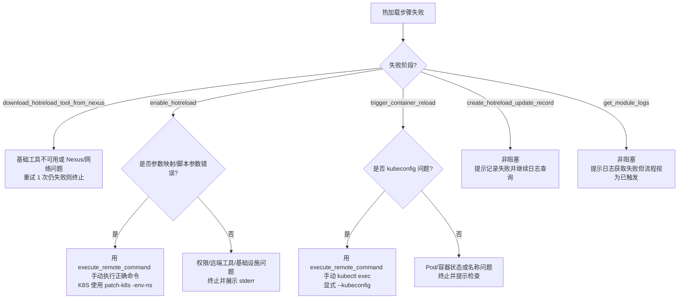

# REFERENCES-HOTRELOAD — 模块热更新执行细节

> 本文件存放**工作流四：模块热更新**的执行级细节与强制约束。`SKILL.md` 只保留骨架流程，调用前必读本文件。
> 具体 tool 的 schema、参数和返回值以当前 MCP server `pipeline-integration-mcp` 为准。
> **调用优先级**：优先使用当前客户端已暴露的 `pipeline-integration-mcp` tools。Claude Code 通常为 `mcp__pipeline-integration-mcp__*`；Codex 使用当前会话注入的 MCP 命名空间（server 名中的 `-` 可能显示为 `_`）。只有当前会话没有可用 MCP tool、且用户明确确认这是唯一可行路径时，才允许临时脚本直连 MCP HTTP endpoint 作为降级方案。降级方案不得作为默认路径。

---

## 0. MCP 调用与降级原则

1. **默认路径**：直接调用当前会话中已注册的 `pipeline-integration-mcp` tools，例如 `get_environment_info`、`enable_hotreload`、`trigger_container_reload`。实际 tool 名称以当前客户端暴露为准，不要硬编码 `mcp__pipeline-integration-mcp__` 前缀；Codex 中可能是下划线命名空间。禁止在 tools 可用时改用 `curl`、`wget`、Python、Node.js 或 PowerShell 直连 endpoint。
2. **工具发现失败**：先按 `REFERENCES-DISCOVERY.md` 判断是否为首次注册未刷新、token 失效、server 未连接或 tool 不存在；能通过刷新/重新注册恢复时，停止并提示用户处理。
3. **最后降级**：仅当当前 Claude Code 或 Codex 会话无法暴露 MCP tools、但平台 HTTP MCP server 已知可用，且用户明确同意继续时，才可用临时脚本调用 HTTP endpoint。
4. **脚本选择**：降级脚本只用于 MCP 调用不可达的兜底场景；简单远程命令优先用 `execute_remote_command`，复杂 shell 优先写成远端 heredoc 或本地临时脚本文件，避免在 one-liner 中堆叠多层引号。Windows 默认使用 PowerShell，Linux/macOS 使用 Bash；不要为了普通参数转换提前引入 JS。
5. **临时脚本要求**：若必须创建 Node.js/Python 临时脚本，应写入临时文件执行，完成后说明用途；避免把包含引号、换行、JSON、shell 变量的复杂内容塞进一行命令。

---

## 1. 适用范围与硬性约束

- **适用环境**：`platform_type = paas`（docker-compose）与 `platform_type = kubernetes`（Deployment/StatefulSet）。
- **禁止环境**：
  - `platform_type = binary` 一律拒绝热更新，立即终止并告知用户「二进制环境暂不支持热更新」。
  - `env_type = UAT` 一律拒绝热更新，立即终止并告知用户「UAT 环境不支持热更新」。
- **一个容器/Pod 只服务一个模块**：不支持单容器多模块并发热更新，多模块需分别触发。
- **热更新 ≠ 提测**：热更新只替换容器内制品文件并重启进程，不经过 CI/镜像构建链路；模块正式提测时前端会因最近一次更新为 hotreload 而弹框提醒（见 web-frontend §5.2.2）。

---

## 2. 自然语言输入解析

### 2.1 输入示例

以下表述都属于模块热更新，必须跳过提交代码、CI 编译和 `upgrade_application` 后台更新任务，直接走本地上传与环境内生效流程：

```text
将本地 target/aiforce2.jar 热更新 https://devops.ks1.wezhuiyi.com/pipeline/project/10000054/release/20000526/env/30035160/application 环境的 aiforce 的 aiforce2 模块
将本机的 app.json 文件更新到流水线环境里 http://demo.ks1.wezhuiyi.com/pipeline/project/10000034/release/20000173/env/30003935/application
将本机的 app.json 文件热更新到流水线环境里 http://demo.ks1.wezhuiyi.com/pipeline/project/10000034/release/20000173/env/30003964/application
```

目前支持通过 `--env` 和 `--unset-env` 选项设置/取消环境变量，需按以下规则识别并透传。环境变量变更**只影响热加载流程本身**，不改变原镜像启动命令。

| 字段 | 来源 | 默认值 | 说明 |
|------|------|--------|------|
| `local_file` | 用户自然语言 | 无（必填） | 本地文件或目录路径；缺失则询问 |
| `project_id` / `env_id` | 从 `pipeline_url` 解析 | 无（必填） | 解析失败则询问 |
| `env_ns` | MCP 环境查询返回 | 无 | K8S 环境命名空间，如 `devops-30035160-sit-jaeger-master` |
| `component_name` | 用户自然语言 | 无 | 产品/组件名，如 `aiforce` |
| `module_name` | 用户自然语言 | 无 | 子模块名，如 `aiforce2` |
| `target_dir` | 用户指定 | `/app/bin` | 容器内目标目录 |
| `target_filename` | 用户指定 | 本地文件 basename | 仅文件上传时作为 Nexus 目标文件名；目录上传忽略 |
| `env_vars` | 用户 `--env` 选项 | 无 | 可选。要设置的环境变量列表，如 `APP_MODE=dev`、`DEBUG=1` |
| `unset_env_vars` | 用户 `--unset-env` 选项 | 无 | 可选。要取消的环境变量名列表，或 `ALL` 表示全部取消 |

### 2.3 用户语义识别示例

以下示例必须识别为带环境变量变更的热更新请求：

```text
将本地 a.jar 热更新到环境，并设置 --env APP_MODE=dev --env DEBUG=1
热更新到环境，并取消 --unset-env OLD_FLAG
热更新并取消全部环境变量 --unset-env ALL
```

- 参数 `--env` 与 `--unset-env` 可重复出现；`--env` 后跟 `KEY=VALUE` 字符串，`--unset-env` 后跟变量名或 `ALL`。
- 无 `--env` / `--unset-env` 时，环境变量相关字段为空，不额外设置或取消任何变量。

### 2.4 解析规则

- 从 `pipeline_url` 用正则提取 `/project/<id>/.../env/<id>/`。
- 只要语义包含“本机/本地 `<文件或目录>` 更新到流水线环境/环境里”“热更新/热加载到环境”“直接替换容器内制品”，即判定为热更新；**禁止**改走提交代码、CI 编译或 `upgrade_application`。
- 缺失的必填字段（`local_file`、环境标识）必须补充询问用户，**禁止猜测**。
- 目标目录/文件名缺失时使用默认值，无需询问。
- **本地路径存在性校验**：解析后必须校验 `local_file` 实际存在；文件或目录不存在则终止流程并提示「本地路径不存在：<path>」，禁止进入上传（对应 HR-006）。相对路径基于当前会话工作目录解析，绝对路径优先。

---

## 3. 模块匹配（match_module）

调用 `get_environment_info`（或环境模块列表查询）获取当前环境的模块列表：

### 3.1 模块列表获取策略

1. **正常获取**：环境接口返回模块列表 → 按以下匹配规则处理。
2. **模块列表为空或获取失败**：
   - 从环境接口返回的数据中筛选 `application_type = 7` 或 `application_type = 8` 的模块（产品/组件级别）；
   - 列出这些产品/组件让用户选择当前模块属于哪个产品；
   - 用户也可在请求时直接说明，如「将本地的 apprt 更新到 xx 环境的 aiforce 组件的 aiforce2 模块」，skill 从自然语言中解析出 `component_name=aiforce` 和 `module_name=aiforce2`。

### 3.2 匹配规则

1. **精确匹配**：用户指定 `module_name` 在模块列表中 → 直接使用该模块的 `moduleId`。
2. **父组件回退**：用户指定 `module_name`（如 `aiforce2`）不在列表，但同环境存在父组件（如 `aiforce`）→
   - 上传路径仍用用户指定的子模块名 `aiforce2`；
   - 更新记录的 `moduleId` 用父组件 `aiforce` 的 id；
   - **必须向用户确认**「环境只有 aiforce，将以 aiforce 记录更新历史，确认继续？」，用户拒绝则终止。
3. **均无匹配**：终止并提示「未找到匹配模块」，列出可选模块供用户重新指定。

> 关键：上传路径用子模块名，更新记录用父组件 moduleId。两者可能不同。

---

## 4. 部署文件镜像查找（find_images_from_deployments）

在模块匹配成功后、执行热更新前，需要从本地部署文件中查找镜像信息，用于确认热更新目标。

### 4.1 模块根目录定位

根据用户指定的 `module_name`（如 `aiforce2`），判断当前工作目录是否匹配：

1. **当前目录即模块根目录**：当前目录名与 `module_name` 相同。
2. **当前目录是模块子目录**：向上遍历父目录，找到与 `module_name` 同名的目录作为模块根目录。
3. **均不匹配**：提示用户切换到模块目录或指定正确的路径，终止流程。

示例：
- 用户指定 `module_name = aiforce2`
- 当前工作目录：`/projects/aiforce2/submodule` → 模块根目录为 `/projects/aiforce2`
- 当前工作目录：`/projects/other` → 不匹配，终止

### 4.2 按环境平台查找部署文件

根据环境的 `platform_type` 确定查找路径：

| 环境类型 | 部署文件路径模式 | 说明 |
|----------|------------------|------|
| `kubernetes` | `<模块根目录>/deployments/kubernetes/*deployment.yaml`<br>`<模块根目录>/deployments/kubernetes/*statefulset.yaml` | 匹配所有 deployment 和 statefulset 文件 |
| `paas` | `<模块根目录>/docker-compose.yaml`<br>`<模块根目录>/docker-compose.yml` | 优先 yaml 后缀，两者都存在时合并处理 |

### 4.3 镜像提取规则

#### K8S 部署文件（deployment.yaml / statefulset.yaml）

从 YAML 中提取所有 `spec.template.spec.containers[*].image` 和 `spec.template.spec.initContainers[*].image`：

**多文档处理**：如果 YAML 文件包含多个 Deployment/StatefulSet 声明（使用 `---` 分隔符的多文档 YAML），必须遍历所有文档对象提取镜像，不能只读取第一个。

```yaml
# 第一个 Deployment
---
apiVersion: apps/v1
kind: Deployment
metadata:
  name: app-main
spec:
  template:
    spec:
      containers:
        - name: main
          image: registry.example.com/group/image:tag
---
# 第二个 StatefulSet
apiVersion: apps/v1
kind: StatefulSet
metadata:
  name: app-worker
spec:
  template:
    spec:
      containers:
        - name: worker
          image: registry.example.com/group/worker:tag
      initContainers:
        - name: init
          image: registry.example.com/group/init:tag
```

提取结果：`[registry.example.com/group/image:tag, registry.example.com/group/worker:tag, registry.example.com/group/init:tag]`

**单文档示例**：

```yaml
spec:
  template:
    spec:
      containers:
        - name: main
          image: registry.example.com/group/image:tag
        - name: sidecar
          image: registry.example.com/group/sidecar:tag
      initContainers:
        - name: init
          image: registry.example.com/group/init:tag
```

提取结果：`[registry.example.com/group/image:tag, registry.example.com/group/sidecar:tag, registry.example.com/group/init:tag]`

#### PaaS 部署文件（docker-compose.yaml / docker-compose.yml）

从 YAML 中提取所有 `services.<service>.image`：

```yaml
services:
  app:
    image: registry.example.com/group/image:tag
  worker:
    image: registry.example.com/group/worker:tag
```

提取结果：`[registry.example.com/group/image:tag, registry.example.com/group/worker:tag]`

### 4.4 镜像去重与用户确认

提取所有镜像后，按以下规则处理：

| 镜像数量 | 去重后数量 | 处理方式 |
|----------|-----------|----------|
| 0 | 0 | 终止，提示「未找到镜像信息，请检查部署文件」 |
| 1 | 1 | 自动使用该镜像，无需用户确认 |
| 多个 | 1（相同镜像） | 自动使用该镜像，更新所有关联容器，无需用户确认 |
| 多个 | 多个（不同镜像） | **必须让用户选择**：列出所有镜像，让用户明确指定要更新哪些 |

**用户确认格式**（多个不同镜像时）：

```
在部署文件中发现多个不同镜像：
1. registry.example.com/group/image:v1.0
2. registry.example.com/group/sidecar:v2.0
3. registry.example.com/group/init:v1.5

请指定要热更新的镜像（可多选，用逗号分隔，如 1,2）：
```

用户选择后，只更新选中镜像关联的容器。

### 4.5 错误处理

| 场景 | 处理方式 |
|------|----------|
| 模块根目录不匹配 | 终止，提示「当前目录不属于模块 <module_name>，请切换到模块目录或指定正确路径」 |
| 部署文件不存在 | 终止，提示「未找到部署文件：<路径>」 |
| 部署文件格式错误 | 终止，提示「部署文件解析失败：<错误信息>」 |
| 镜像字段缺失 | 终止，提示「部署文件中未找到镜像信息」 |

---

## 5. 工具签名（以当前 MCP server 为准）

### 5.1 本地二进制 `devops-hotreload-uploader`（非 MCP tool，skill 本机执行）

**重要：上传本地构建物到 Nexus 必须使用此本地二进制，禁止使用任何 MCP 工具执行上传操作。**

本地执行前先解析当前客户端平台与架构，确认 uploader 是否存在于用户家目录：

- 默认本地目录：`~/.devops-hotreload/bin/`。
- Linux/macOS 文件名：`devops-hotreload-uploader`。
- Windows 文件名：`devops-hotreload-uploader.exe`。
- 若本地不存在（或后续支持 MD5 校验且不一致），必须先下载到上述目录；**Nexus 工具下载地址匿名，可直接使用 `curl`/`wget`（Linux/macOS）或 `Invoke-WebRequest`（Windows PowerShell）下载**；下载失败重试 1 次。

Nexus 工具下载路径规则：

```text
http://pkg.in.wezhuiyi.com/repository/infra/devops-hotreload-uploader/latest/<os>/<arch>/<binary>
```

平台映射示例（实际执行时根据本机 OS 与架构动态选择对应路径）：

| 本机平台 | `<os>/<arch>/<binary>` | 完整示例 |
|----------|-------------------------|----------|
| macOS（Darwin）x86_64 | `darwin/amd64/devops-hotreload-uploader` | `http://pkg.in.wezhuiyi.com/repository/infra/devops-hotreload-uploader/latest/darwin/amd64/devops-hotreload-uploader` |
| macOS（Darwin）ARM64 | `darwin/arm64/devops-hotreload-uploader` | `http://pkg.in.wezhuiyi.com/repository/infra/devops-hotreload-uploader/latest/darwin/arm64/devops-hotreload-uploader` |
| Linux x86_64 | `linux/amd64/devops-hotreload-uploader` | `http://pkg.in.wezhuiyi.com/repository/infra/devops-hotreload-uploader/latest/linux/amd64/devops-hotreload-uploader` |
| Linux ARM64 | `linux/arm64/devops-hotreload-uploader` | `http://pkg.in.wezhuiyi.com/repository/infra/devops-hotreload-uploader/latest/linux/arm64/devops-hotreload-uploader` |
| Windows x86_64 | `windows/amd64/devops-hotreload-uploader.exe` | `http://pkg.in.wezhuiyi.com/repository/infra/devops-hotreload-uploader/latest/windows/amd64/devops-hotreload-uploader.exe` |

上传命令示例（Windows PowerShell）：

```powershell
& "$HOME\.devops-hotreload\bin\devops-hotreload-uploader.exe" `
  --local "xxx" `
  --remote-dir "10000054/env-name-30035160/" `
  --filename "xxx"
```

上传命令示例（Windows Git Bash 路径）：

```bash
/c/Users/niewangzai/.devops-hotreload/bin/devops-hotreload-uploader.exe \
  --local xxx \
  --remote-dir '10000054/env-name-30035160/' \
  --filename xxx
```

通用参数：

```bash
devops-hotreload-uploader \
  --local <本地文件或目录> \
  --remote-dir <项目id>/<环境名-环境id>/<模块名>/ \
  --filename <Nexus 目标文件名>   # 仅文件上传有效；目录上传忽略，固定 hot-upgrade.tar
```

- `--local`：本地文件或目录路径。
- `--remote-dir`：Nexus hot-reload 仓库下的远端目录，按 `项目id/环境名-环境id/模块名/` 组织（project_id、env_name、env_id 均从 MCP 环境接口获取）；如果只有项目/环境两级，也必须保留末尾 `/`。
- `--filename`：远端文件名；上传文件时必填，上传目录时忽略。Go flag 兼容 `-filename` 写法，但文档统一使用 `--filename`。
- 文件上传：原样 PUT 到 `--remote-dir/--filename`。
- 目录上传：自动打包为 `hot-upgrade.tar`（仅 tar 不压缩）上传，文件名固定。
- 输出 JSON 示例：

```json
{
  "download_url": "https://pkg.in.wezhuiyi.com/repository/hot-reload-package/10000054/env-name-30035160/xxx",
  "remote_path": "10000054/env-name-30035160/xxx"
}
```

- 内置 base64 混淆的 Nexus 账号密码，无需 skill 传认证；必要时可通过 `--auth <base64>` 覆盖。
- `--nexus-base-url` 可覆盖 hot-reload 制品仓库地址，默认使用内置值。

### 5.2 热更新 MCP tools（integration-mcp 新增）

| Tool | 关键输入 | 作用 |
|------|----------|------|
| `download_hotreload_tool_from_nexus` | toolName, os, arch, targetHost | **每次热更新前必须调用**；按架构下载工具到目标机 `~/.devops-hotreload/bin/`，MD5 校验，已一致则跳过下载但保留日志 |
| `enable_hotreload` | envType, host/控制机, envNs, module | PaaS 调 `generate-compose-override`；K8S 调 `patch-k8s`；已开启则跳过 |
| `trigger_container_reload` | envType, host/container/pod, namespace, downloadUrl, targetDir | `docker exec`/`kubectl exec` 写 `/tmp/hotreload.trigger` |
| `create_hotreload_update_record` | projectId, envId, moduleId, description | 调后端 `POST /v1/projects/{project_id}/applications/{application_id}/history`，updateType 固定 hotreload；`description` 必须包含实际模块名 |
| `execute_remote_command`（扩展） | host, command | 在 PaaS 主机或 172.16.30.85 中控机执行，返回 exit/stdout/stderr |

> 复用已有 `get_environment_info`（环境信息/模块列表/IP/env_type/env_ns）与 `get_module_logs`（日志）。

---

## 6. 开启热加载判定、参数映射与目录规则

### 6.0 MCP 参数映射（热加载 tools）

调用 MCP tool 时以当前 tool schema 字段名为准；当 tool 内部转调 shell 工具时，必须确认下列映射，避免把 MCP 字段名原样误传给底层脚本：

| MCP tool | MCP 字段 | 底层工具/命令参数 | 说明 |
|----------|----------|-------------------|------|
| `enable_hotreload` | `env_type` | 选择 `generate-compose-override` 或 `patch-k8s` | `paas` 走 compose override；`k8s`/`kubernetes` 走 K8S patch |
| `enable_hotreload` | `host` | PaaS 目标主机 | 仅 PaaS 必填 |
| `enable_hotreload` | `env_ns` | `patch-k8s -env-ns <env_ns>` | **不是** `-namespace` |
| `enable_hotreload` | `module` | `-module <module>` | 模块目录名 |
| `trigger_container_reload` | `env_ns` | `kubectl --namespace <env_ns>` | K8S 必填 |
| `trigger_container_reload` | `pod_name` | `kubectl exec <pod_name>` | K8S 必填 |
| `trigger_container_reload` | `container_name` | `kubectl exec -c <container_name>` / `docker exec <container>` | 多容器 Pod 必填 |
| `trigger_container_reload` | `download_url` | 触发文件 `URL="..."` | 写入 `/tmp/hotreload.trigger` |
| `trigger_container_reload` | `target_dir` | 触发文件 `TARGET_DIR="..."` | 默认 `/app/bin` |
| `trigger_container_reload` | `env_set` | 触发文件 `ENV_SET="..."` | `KEY=VALUE` 用 `\n` 分隔的字符串，如 `APP_MODE=dev\nDEBUG=1` |
| `trigger_container_reload` | `env_unset` | 触发文件 `ENV_UNSET="..."` | 多个变量名用空格分隔的字符串，或 `ALL` |

### 6.1 是否已开启

- **PaaS**：目标主机上模块目录是否存在 `docker-compose.override.yml` 且包含 hotreload 挂载/命令覆盖。
- **K8S**：Deployment/StatefulSet 普通容器是否已挂载 `/tools/hotreload.sh` 且 command 已覆盖。
- **已开启**：跳过 `enable_hotreload` 的实际执行（不再重复生成 override / patch K8S），但**不能跳过**此前已执行的 `download_hotreload_tool_from_nexus`。
- **未开启**：执行 `enable_hotreload` 后**等待 30 秒**，让容器/Pod 重启完成；agent 只需确认服务确实已经重启，**不要尝试进入容器内验证用户指定的环境变量是否生效**。

> 环境变量由 `hotreload.sh` 在应用启动前 `source` 生效，直接登录容器后通过其他 shell 会话查看变量值仍是原值，属于正常现象。如需确认变量加载情况，应通过控制台日志或容器内 `/tmp/hotreload.log` 判断。

> **重要顺序**：`download_hotreload_tool_from_nexus` 必须在 `enable_hotreload` 之前调用，且每次热更新都要执行。工具内部会对比本地与远程 MD5，一致则跳过实际下载，但仍应产生日志，方便排查工具版本问题。

### 6.2 目录拼接与 K8S kubeconfig

- PaaS compose：`/data/jenkins/workspace/application-data/pkg/<xxx-pkg>/<module>/`（`-pkg` 后缀目录唯一；找不到模块报错）。
- K8S 部署：`/data/jenkins/workspace/k8s-envs/<env-ns>/opt/<module>/deployments/kubernetes/`。
- K8S kubeconfig：`/data/jenkins/workspace/k8s-envs/<env-ns>/opt/.kube_config.yaml`。
- K8S 中控机固定 `172.16.30.85`。

当 `trigger_container_reload` 因 `kubectl` 默认连接 `localhost:8080`、`connection refused`、`no configuration has been provided` 等 kubeconfig 问题失败时，不要重复调用同一失败 tool；改用 `execute_remote_command` 在 K8S 中控机手动执行等价 `kubectl` 命令，并显式带上：

```bash
kubectl --kubeconfig /data/jenkins/workspace/k8s-envs/<env-ns>/opt/.kube_config.yaml \
  -n <env-ns> exec <pod_name> -c <container_name> -- sh -c 'cat > /tmp/hotreload.trigger <<EOF
URL="<download_url>"
TARGET_DIR="<target_dir>"
EOF'
```

若 Pod 只有一个业务容器，可省略 `-c <container_name>`；若存在 sidecar 或多业务容器，必须先确认容器名。

### 6.3 触发文件格式（`/tmp/hotreload.trigger`）

```bash
URL="<Nexus download_url>"
TARGET_DIR="<容器内目标目录>"
ENV_SET='KEY1=VALUE1\nKEY2=VALUE2'
ENV_UNSET='KEY1 KEY2'
```

或取消全部环境变量：

```bash
ENV_UNSET='ALL'
```

- `URL`：Nexus 下载地址，必填。
- `TARGET_DIR`：容器内目标目录，默认 `/app/bin`。
- `ENV_SET`：可选。需要设置的环境变量，多组 `KEY=VALUE` 用 `\n` 分隔，整组作为字符串写入触发文件。
- `ENV_UNSET`：可选。需要取消的环境变量，多个变量名用空格分隔；值为 `ALL` 时表示取消全部环境变量。

容器内 `hotreload.sh` 检测到该文件后下载；文件名为 `hot-upgrade.tar` 则解压到 `TARGET_DIR`，否则直接移动到 `TARGET_DIR`。`hotreload.sh` 在下载/移动完成后按 `ENV_SET`/`ENV_UNSET` 设置或取消对应环境变量，再重启进程。

### 6.4 更新记录描述规范

调用 `create_hotreload_update_record` 时，`description` 必须包含**实际热更新的模块名**，不能只写文件名和目标目录。

原因：环境应用列表里的记录可能归属父组件 `moduleId`，但一个产品组件下可能包含多个实际模块；若描述缺少模块名，后续无法判断本次热更新实际作用于哪个模块。

推荐格式：

```text
热更新 <module_name> 模块的 <target_filename 或 hot-upgrade.tar> 到 <target_dir> 目录
热更新 <module_name> 模块的 <target_filename 或 hot-upgrade.tar> 到 <target_dir> 目录，设置环境变量 <KEY1=VALUE1>, <KEY2=VALUE2>
热更新 <module_name> 模块的 <target_filename 或 hot-upgrade.tar> 到 <target_dir> 目录，取消环境变量 <VAR>
热更新 <module_name> 模块的 <target_filename 或 hot-upgrade.tar> 到 <target_dir> 目录，取消全部环境变量
```

示例：

```text
热更新 aiforce2 模块的 ci.yaml 文件到 /app/bin 目录
热更新 web-backend 模块的 hot-upgrade.tar 到 /app/bin 目录
热更新 aiforce2 模块的 a.jar 到 /app/bin 目录，设置环境变量 APP_MODE=dev, DEBUG=1
热更新 web-backend 模块的 hot-upgrade.tar 到 /app/bin 目录，取消环境变量 OLD_FLAG
热更新 web-backend 模块的 hot-upgrade.tar 到 /app/bin 目录，取消全部环境变量
```

反例（禁止）：

```text
热更新 ci.yaml 文件到 /app/bin 目录
```

父组件回退场景中：
- `moduleId` 使用父组件 id；
- `description` 仍必须写用户实际指定的子模块名，例如 `aiforce2`。

---

## 7. 失败处理与输出

| 阶段 | 失败处理 |
|------|----------|
| 本地路径不存在 | 终止，提示「本地路径不存在」并回显路径，不进入上传 |
| 环境查询失败 | 终止，返回失败原因 |
| UAT 环境 | 立即终止，提示不支持 |
| 模块无匹配 | 终止，列出可选模块 |
| uploader 下载/上传失败 | 重试 1 次，仍失败终止；上传失败不写更新记录 |
| **download_hotreload_tool_from_nexus 失败** | **重试 1 次，仍失败终止；禁止跳过该步骤直接进入 enable** |
| enable 失败 | 先判断原因：参数映射错误（如 `-namespace`）→ 用 `execute_remote_command` 手动执行正确 `patch-k8s -env-ns <env_ns> -module <module>` 或 PaaS override 命令；基础设施/权限/远端工具缺失 → 终止并返回 stderr |
| trigger 失败 | 先判断原因：kubeconfig 缺失或指向 `localhost:8080` → 用 `execute_remote_command` 手动执行带 `--kubeconfig` 的 `kubectl exec`；容器/Pod 不存在或状态异常 → 终止，建议检查容器/Pod 状态 |
| 更新记录创建失败 | **不阻塞**：提示记录失败，但仍返回已上传地址与触发状态 |
| 日志获取失败 | **不阻塞**：提示日志失败，流程视为完成 |

### 7.1 失败处理决策树



### 输出要点

- 上传成功：展示 `download_url`、`remote_path`。
- 触发成功：说明已写入触发文件，容器将自动下载并重启。
- 更新记录：说明记录到哪个模块（父组件 moduleId），并回显包含实际模块名的 `description`。
- 日志：附最近日志关键片段，便于确认热更新生效；若用户指定了 `--env` / `--unset-env`，应提示通过**控制台日志**或容器内 **`/tmp/hotreload.log`** 判断变量是否已经加载生效，**不要引导用户登录容器后直接查看变量值**（登录后的 shell 会话看到的仍是未改变的原值）。
- 关闭热加载提示：热更新完成后必须告知用户如何关闭热加载。
  - **PaaS（docker-compose）环境**：通过流水线重新更新/部署一次当前版本即可关闭热加载（override 文件会被覆盖）。
  - **K8S 环境**：需要通过流水线界面的「重构」按钮触发环境重构才能关闭热加载，普通重新部署/滚动更新不会移除已 patch 的热加载配置。

---

## 8. 注意事项

- `target_dir` 默认 `/app/bin`；镜像启动命令固定 `$WORKDIR/bin/apprt serve`，热加载脚本作为 1 号进程接管。
- 首次开启热加载需等 30 秒；已开启则触发后很快生效，无需专门等待。
- 工具自动更新：每次调用前比对本地与远程 MD5，不一致自动重下，无需人工更新各环境工具。
- `hotreload.sh` 注入容器后不自动更新（视为临时稳定版本）。
- **关闭热加载**：
  - **PaaS（docker-compose）**：流水线重新更新/部署一次即可，`docker-compose.override.yml` 会被新编排覆盖。
  - **K8S**：需要通过流水线界面的「重构」按钮触发环境重构才能关闭热加载，普通重新部署/滚动更新不会移除已 patch 的 `/tools` 挂载和 command 覆盖。
- 不要默认引入 JS/Node.js 处理热加载流程；只有 MCP tools 在当前会话不可用、且用户确认走 HTTP MCP 降级时，才创建临时脚本。普通流程应优先使用已暴露的 MCP tools 和 `execute_remote_command`。
